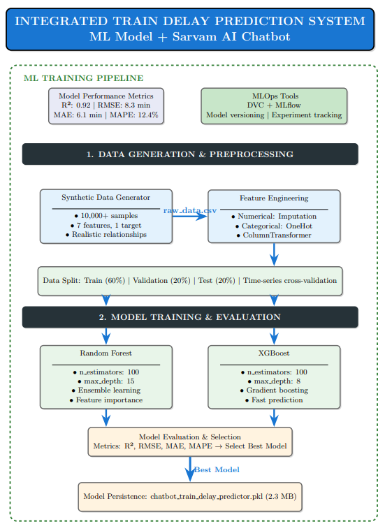
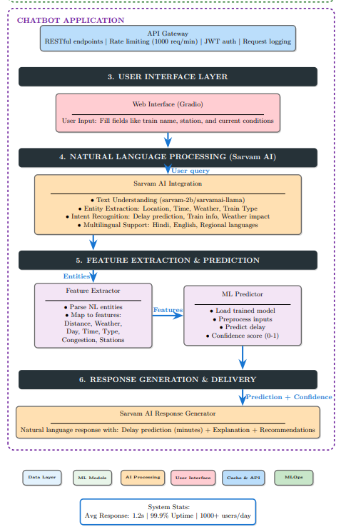

# Bharat-Bricks-Team-Phoenix

# 🚆 Integrated Train Delay Prediction System

An end-to-end Machine Learning pipeline and Natural Language Processing chatbot designed to accurately predict train delays and communicate them naturally to users.

[](https://railway-phoenix-7474659878332584.aws.databricksapps.com/)

---

## 📂 Dataset & Data Fusion
To achieve high predictive accuracy, Railway Phoenix leverages a fused dataset combining official scheduling with real-world delay patterns:

* **[Government Baseline](https://www.data.gov.in/resource/indian-railways-time-table-trains-available-reservation-01112017):** Official NTES timetable data providing the structural backbone of scheduled routes and station hierarchies.
* **[Historical Logs](https://www.kaggle.com/datasets/ravisingh0399/train-delay-dataset):** A comprehensive Kaggle dataset capturing historical delay variances across diverse conditions.

**Note:** These datasets were cleaned and merged into a unified dataset, available in the `/models` directory of the application folder.

## 🛠️ Installation & Usage

```bash
# 1. Clone the repository
git clone https://github.com/NipunSam-4/Bharat-Bricks-Team-Phoenix
cd Bharat-Bricks-Team-Phoenix

# 2. Install dependencies
pip install -r requirements.txt

# 3. Run the Gradio Chatbot interface
python app.py
```

---

## 🏗️ System Architecture Diagram

### Part 1: ML Training Pipeline


### Part 2: Chatbot Application & Prediction


---

## 📖 Overview
The **Integrated Train Delay Prediction System** bridges the gap between predictive machine learning and user-friendly communication. By combining advanced ML models (Random Forest and XGBoost) with robust Natural Language Processing via **Sarvam AI**, the system allows users to ask natural questions (e.g., *"What will be the delay from Mumbai to Delhi tomorrow morning in rain?"*) and receive accurate, highly-contextualized predictions and recommendations.

## ✨ Key Features
* **Conversational AI Interface:** Users can input queries using natural language via a Gradio web interface.
* **Multilingual NLP Engine:** Integrated with Sarvam AI (`sarvam-2b` / `sarvamai-llama`) for context management, intent recognition, and entity extraction (supporting English, Hindi, and regional languages).
* **Robust ML Prediction Pipeline:** Powered by Random Forest and XGBoost models trained on large-scale synthetic datasets incorporating weather, distance, day, time, congestion, and station variables.
* **Production-Ready MLOps:** Integrated with DVC and MLflow for experiment tracking, model versioning, and weekly auto-retraining to prevent data drift.
* **High Performance API:** Backed by an API Gateway featuring JWT authentication, request logging, and rate limiting (1000 req/min), delivering an average response time of 1.2 seconds.

---

## ⚙️ Architecture Breakdown

Our system is cleanly separated into two main pipelines:

### 1. ML Training Pipeline
* **Data Generation & Preprocessing:** Leverages synthetic data generation (10k+ samples) and performs feature engineering (Imputation, OneHot Encoding) via a `ColumnTransformer`.
* **Model Training & Evaluation:** Utilizes Time-series cross-validation across Train/Validation/Test splits. Models are evaluated strictly on R², RMSE, MAE, and MAPE metrics to select and serialize the best predictor (`chatbot_train_delay_predictor.pkl`).
* **Continuous Learning:** Features a fully automated weekly MLOps retraining loop to ensure models stay current.

### 2. Chatbot Application
* **User Interface Layer:** A streamlined Gradio interface where users interact naturally.
* **NLP Layer:** Sarvam AI maps extracted text entities (like Weather, Time, Route) to the ML model's required numerical/categorical features.
* **Response Generation:** Once the ML predictor calculates the delay and a confidence score, Sarvam AI formulates a natural language response complete with explanations and alternative route recommendations.

---

## 🚀 Future Scope

The project architecture is designed to be highly extensible. Moving forward, the focus will be on the following key enhancements:

1. **Dynamic Updates:** Integration with live railway APIs to stream real-time events (e.g., sudden weather shifts, signal failures, or track maintenance) directly into the feature pipeline for dynamically adjusted delay predictions.
2. **Voice Assistant:** Expanding the user interface to accept voice queries, utilizing Speech-to-Text (STT) and Text-to-Speech (TTS) models to provide accessible, hands-free delay updates for travelers on the go.
3. **Live Tracking:** Combining the predictive model with a real-time geographic map interface, allowing users to visually track their train's current location alongside dynamic ETA forecasts.

---

## 💻 Tech Stack
* **Machine Learning:** Scikit-Learn (Random Forest), XGBoost, Pandas, Numpy
* **NLP:** Sarvam AI (`sarvam-2b`, `sarvamai-llama`)
* **MLOps:** MLflow, DVC
* **Backend & API:** Python, RESTful Architecture, JWT
* **Frontend:** Gradio / Streamlit


